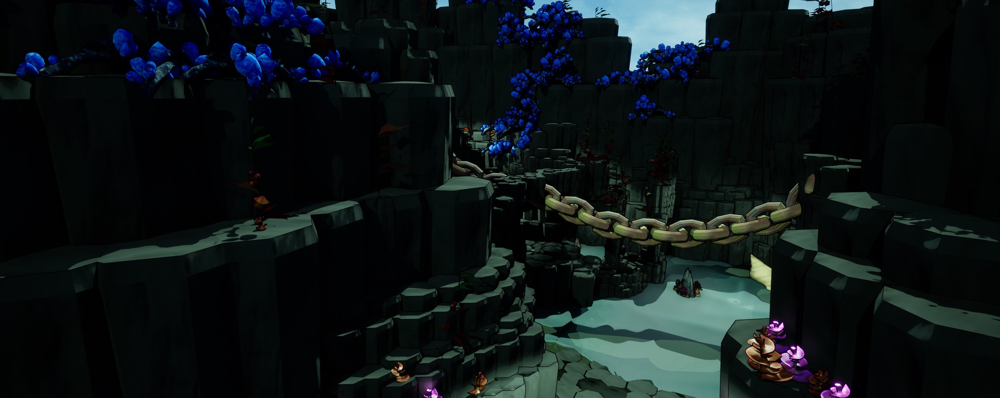

# Stratonaut | A1 Game Studio Project

___
Watch our vertical slice demo on [YouTube](https://youtu.be/yo8GI5MpdaU).

Stratonaut is a rougelite third person shooter heavily inspired by Risk of Rain 2. Collect items 
from chests the randomly spawn in the world to increase your character's power. This is a group project
in our second year of university that was made by Ryan Purse, Luke Wootton, Annie Holliday, Kacper 
Wozniak, Marcus Key-Willcox and Lauren Eady.
